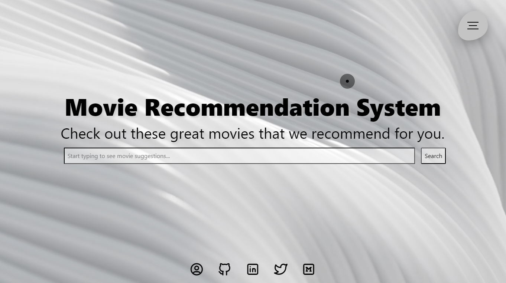
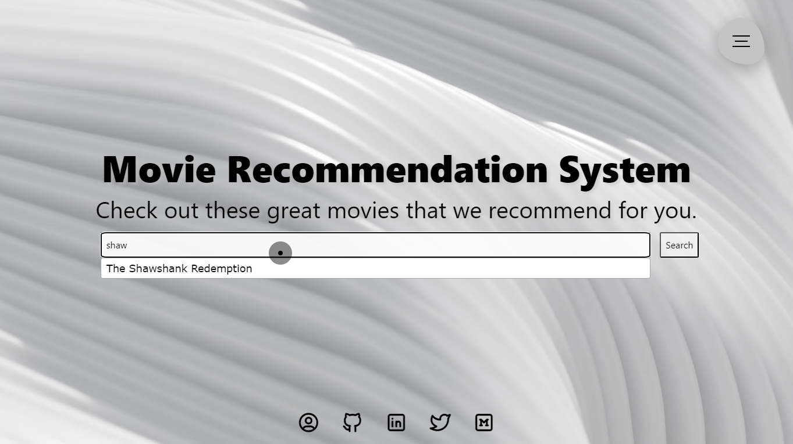
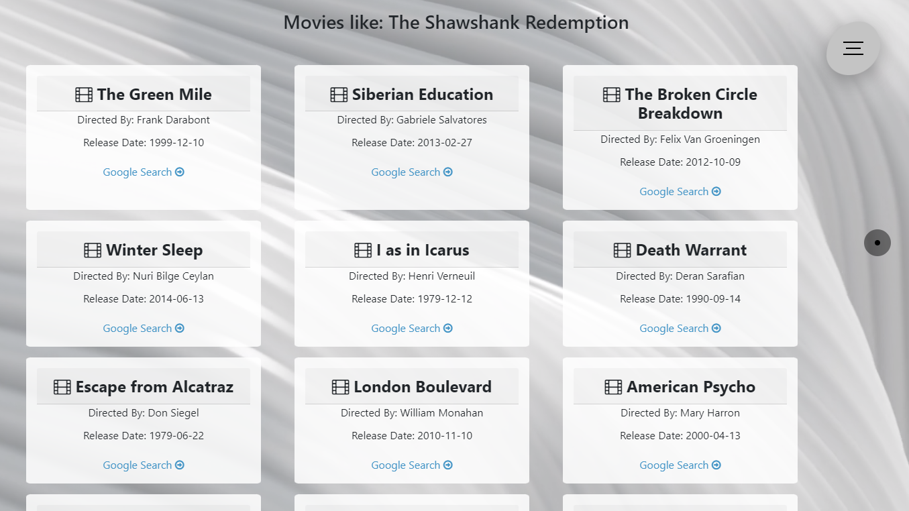

# Movie Search Suggestions
This repository contains all the project files and necessary details about applications required to run the project on your local machine as well as host it as a Django Application on your Server/Domain.

| Title                                    | Description                                                                                                         |
| ---------------------------------------- | ------------------------------------------------------------------------------------------------------------------- |
| Demo                                     | Sample Demo of MRS Hosted on free cloud PaaS                                                                       |
| Requirements                             | Requirements and essential steps to get started with the project locally                                           |
| Model Training                           | How the MRS was trained for demo as well as on a large movie dataset                                               |
| Project Versatility                      | Guide on how to plug in any general recommendation model into this project and host it on servers                   |
| Troubleshooting Issues                   | Guide to resolve errors faced during reproducibility                                                               |

<hr>

## 1. Demo

This section provides an overview of the project with a demo to explore its features.

1. Movie Recommendation System Hosted Application Demo
2. Running MRS on Local System
3. Sample Screenshots
   
   - **Home Screen**  
     
   
   - **Navigation Screen**  
     
   
   - **Search with Auto Suggestion**  
     
   
   - **Recommended Movies**  
     

<hr>

## 2. Requirements

To build this project without any errors/issues, the following requirements need to be satisfied:

1. Create a Virtual Environment using Python (>=3.8, tested on 3.9.16)
2. Install the dependencies from the requirements text file in the repository.

<hr>

## 3. Model Training

### 3.1 Training & Inference

For a complete guide on training and inference using the trained model, refer to the provided Python notebook.

### 3.2 Django Web Application Integration

A detailed guide explains the complete approach and directory structure essential to understand Django integration.

<hr>

## 4. Project Guide

### 4.1 Running it on Cloud

A detailed guide explains the steps needed to deploy this application on a cloud-based service.

### 4.2 Running Locally

Ensure you have completed the requirements section for creating your environment. Activate it using:

```shell
/path/to/env/bin/activate
```

Once activated, navigate to the project root directory and run:

```shell
python manage.py runserver
```

After starting the server, visit `http://localhost:8000` in your browser to access the demo locally.

By default, this project will run on a demo model. If you wish to change the model, train and download the model of your choice using the provided Python notebook. Then, integrate it by modifying these two lines inside `recommender/views.py`:

```python
Line 5 : movies_data = pd.read_parquet("static/<dataset_name>.parquet")
Line 73: model = pa.parquet.read_table('static/<model_name>.parquet').to_pandas()
```

Ensure the dataset and model are placed in the `static` directory.

---

### Additional Details

This project implements a movie recommendation system with a simple web interface built using HTML, CSS, and JavaScript.

#### Inputs
- Users can search for movies by providing a partial or complete movie name.

#### Outputs
- The system provides movie recommendations based on user input.

#### Dependencies
- CSS files: `cursor.css`, `page.css`, `navbar.css`
- Logo: `static/logo.png`
- Background video: `static/production ID_4779866.mp4`
- External libraries: `jQuery`, `Bootstrap`, `Font Awesome`, `Tabler Icons`

#### Usage
1. Open the HTML file in a web browser.
2. Type the name of a movie in the search bar to get recommendations.

**Note:** The database currently includes the top 2.5K movies based on IMDb ratings.

> **A new version of the movie recommendation system is in development, aiming to process a larger dataset with better recommendations and additional features like recommendation buckets and mutual sharing. Stay tuned for updates!**

